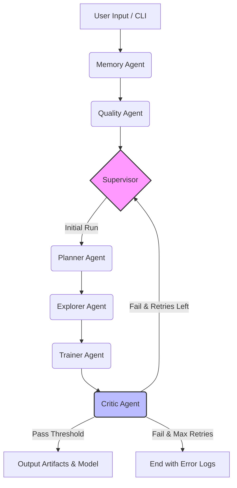

# 🧠 Data Samanvayah Agent (DSA)

**An Enterprise-Grade, Multi-Agent AutoML System powered by LangGraph.**

DSA (Data Samanvayah - "Data Coordination" in Sanskrit) is not just an AutoML tool; it is a stateful, multi-agent orchestration system designed to mimic a team of data scientists. It utilizes episodic memory to learn from past executions, dynamically plans preprocessing steps, and employs a critic-driven retry loop to ensure model quality.

[](https://www.python.org/downloads/)
[](https://github.com/langchain-ai/langgraph)
[](https://smith.langchain.com)
[](#human-in-the-loop)
[](./Dockerfile)
[](https://github.com/devsripathy/Data-Samanvayah-Agent/actions)

---

## 🏗️ Architecture & Agent Orchestration

DSA uses a **StateGraph** where specialized agents pass a unified `DSAState` object. The `Supervisor` acts as the central router, while the `Critic` enables dynamic, LLM-evaluated retry loops.



## 🆚 DSA vs. Traditional AutoML

| Feature | Traditional AutoML (e.g., AutoGluon, H2O) | Data Samanvayah Agent (DSA) |
| :--- | :--- | :--- |
| **Architecture** | Monolithic, hardcoded pipeline | Modular Multi-Agent LangGraph Orchestration |
| **Context & Memory** | Stateless (forgets past runs) | **Episodic & Semantic Memory** (learns from past datasets) |
| **Error Handling** | Hard failures / basic grid retries | **Critic-driven dynamic retry loops** with LLM reasoning |
| **Explainability** | Post-hoc SHAP/LIME only | Native Planner reasoning & Critic feedback logs |
| **Extensibility** | Difficult to inject custom logic | Drop-in custom Agent nodes |

---

## 🚀 Quickstart

### Prerequisites
- Python 3.12+
- [uv](https://github.com/astral-sh/uv) (Recommended) or `pip`

### 1. Installation
```bash
# Clone the repository
git clone https://github.com/devsripathy/Data-Samanvayah-Agent.git
cd Data-Samanvayah-Agent

# Create virtual environment (using uv or venv)
python -m venv .venv
source .venv/bin/activate  # On Windows: .venv\Scripts\activate

# Install dependencies
pip install -e ".[dev]"  # Includes dev tools for testing
# OR: pip install -e .  # Production installation
```

### 2. Configure Environment
```bash
# Copy example environment file
cp .env.example .env

# Edit .env and add your keys:
# - OPENAI_API_KEY=sk_...
# - LANGSMITH_API_KEY=... (optional, for observability)
# - VECTOR_STORE_TYPE=memory (or qdrant/chroma/pinecone)
```

### 3. Run the Pipeline
```bash
# List available sessions
python main.py list-sessions

# Create and run a new session
python main.py run data/sample.csv --session-id my_experiment

# Resume a previous session
python main.py resume my_experiment

# Check session status
python main.py status my_experiment
```
## 🐳 Docker Deployment
```bash
# Build the Docker image
docker build -t dsa-agent:latest .

# Run with .env file
docker run --env-file .env -v $(pwd)/data:/app/data -v $(pwd)/artifacts:/app/artifacts dsa-agent:latest python main.py run /app/data/sample.csv --session-id docker_run
```

## ✅ Testing & Quality Assurance

```bash
# Run all tests
pytest tests/ -v

# Run with coverage
pytest tests/ --cov=src --cov-report=html

# Run linting and type checking
ruff check src/ tests/ main.py
mypy src/ --ignore-missing-imports
black --check src/ tests/ main.py

# Validate syntax
python -m py_compile main.py
find src -name "*.py" -exec python -m py_compile {} \;
```

**CI/CD Pipeline**: Automated tests run on every push and PR via GitHub Actions (see `.github/workflows/ci.yml`)

---

## 🎯 Production Features (v2.0+)

### Session Management & Persistence
- **Automatic Session Tracking**: Create named sessions with `--session-id`
- **Thread ID Management**: Auto-generated thread IDs for LangGraph checkpointing
- **Session Resumption**: Resume incomplete sessions and continue from where you left off
- **JSON Checkpoints**: Session state saved to `./data/sessions/` for recovery

### Human-in-the-Loop (HITL)
- **Confidence-Based Routing**: Supervisor makes decisions based on confidence scores
- **Intelligent Interrupts**: Pauses before Critic agent when confidence is low
- **Approval Workflow**: Human reviewers can approve/reject decisions and continue
- **Enable with**: `--enable-hitl` flag or `ENABLE_HITL=true` in `.env`

### Observability & Tracing
- **LangSmith Integration**: Full tracing of agent execution
- **Custom Event Logging**: Log decision points and trace events
- **Optional Setup**: Works without LangSmith; enable with `LANGSMITH_API_KEY`
- **Dashboard Support**: View agent conversations in LangSmith dashboard

### Vector Store Integration
- **Memory Agent**: Retrieves similar past executions
- **Multiple Backends**: Support for Qdrant, Chroma, Pinecone, or in-memory
- **Configure with**: `VECTOR_STORE_TYPE` environment variable
- **Extensible**: Easy to add custom vector store implementations

### Type Safety & Serialization
- **Pydantic v2 Models**: Fully typed DSAState with automatic validation
- **JSON Serialization**: Safe checkpoint serialization with custom field serializers
- **Model Validation**: Automatic validation of state transitions

---

## 📚 Documentation

- **[UPGRADES.md](./UPGRADES.md)** - Complete feature guide with API reference
- **[SETUP.md](./SETUP.md)** - Getting started and configuration guide
- **[ARCHITECTURE_DIAGRAMS.md](./ARCHITECTURE_DIAGRAMS.md)** - System architecture visualizations
- **[README_UPGRADES.md](./README_UPGRADES.md)** - Feature highlights and examples

---

## 🏗️ Production-Ready Architecture
        raise typer.Exit(code=130)
    except Exception as e:
        logger.error(f"Pipeline failed: {e}")
        console.print(f"[bold red]❌ Pipeline failed:[/bold red] {e}")
        raise typer.Exit(code=1)
