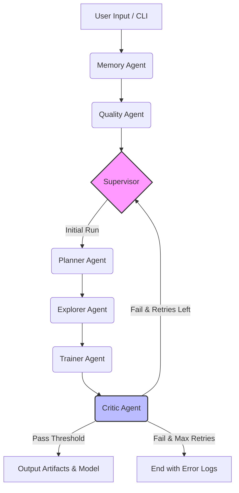

# 🧠 Data Samanvayah Agent (DSA)

**An Enterprise-Grade, Multi-Agent AutoML System powered by LangGraph.**

DSA (Data Samanvayah - "Data Coordination" in Sanskrit) is not just an AutoML tool; it is a stateful, multi-agent orchestration system designed to mimic a team of data scientists. It utilizes episodic memory to learn from past executions, dynamically plans preprocessing steps, and employs a critic-driven retry loop to ensure model quality.

[](https://www.python.org/downloads/)
[](https://github.com/langchain-ai/langgraph)
[](./Dockerfile)
[](https://github.com/yourusername/data-samanvayah-agent/actions)

---

## 🏗️ Architecture & Agent Orchestration

DSA uses a **StateGraph** where specialized agents pass a unified `DSAState` object. The `Supervisor` acts as the central router, while the `Critic` enables dynamic, LLM-evaluated retry loops.



## 🆚 DSA vs. Traditional AutoML

| Feature | Traditional AutoML (e.g., AutoGluon, H2O) | Data Samanvayah Agent (DSA) |
| :--- | :--- | :--- |
| **Architecture** | Monolithic, hardcoded pipeline | Modular Multi-Agent LangGraph Orchestration |
| **Context & Memory** | Stateless (forgets past runs) | **Episodic & Semantic Memory** (learns from past datasets) |
| **Error Handling** | Hard failures / basic grid retries | **Critic-driven dynamic retry loops** with LLM reasoning |
| **Explainability** | Post-hoc SHAP/LIME only | Native Planner reasoning & Critic feedback logs |
| **Extensibility** | Difficult to inject custom logic | Drop-in custom Agent nodes |

---

## 🚀 Quickstart

### Prerequisites
- Python 3.12+
- [uv](https://github.com/astral-sh/uv) (Recommended) or `pip`

### 1. Installation
```bash
# Clone the repository
git clone https://github.com/yourusername/data-samanvayah-agent.git
cd data-samanvayah-agent

# Install dependencies using uv (or pip install -e ".[dev]")
uv venv
source .venv/bin/activate
uv pip install -e ".[dev]"
```

### 2. Configuration
Copy the example environment file and add your LLM API key:
```bash
cp .env.example .env
# Edit .env and add your OPENAI_API_KEY
```

### 3. Run the Pipeline
```bash
# Run via Python
python main.py run data/sample.csv --target target_col

# Or via CLI entrypoint
dsa run data/sample.csv -t target_col
```
## 🐳 Docker Deployment
```bash
docker build -t dsa-agent:latest .
docker run --env-file .env -v $(pwd)/artifacts:/app/artifacts dsa-agent:latest run data/sample.csv
```
```

---

### 2. Priority Fix: Clean `main.py` Entry Point
This replaces the basic script with a robust, production-ready CLI using `typer`.

```python
"""Data Samanvayah Agent (DSA) CLI Entry Point."""
import asyncio
import typer
from pathlib import Path
from rich.console import Console

from src.core.graph import dsa_graph
from src.core.state import DSAState
from src.utils.logger import get_logger

logger = get_logger(__name__)
console = Console()
app = typer.Typer(help="Data Samanvayah Agent (DSA) - Enterprise AutoML Pipeline", add_completion=False)

@app.command()
def run(
    dataset: Path = typer.Argument(..., exists=True, help="Path to the input dataset (CSV/Parquet)."),
    target: str = typer.Option(None, "--target", "-t", help="Target column for prediction (auto-detected if omitted)."),
    max_retries: int = typer.Option(3, "--retries", "-r", help="Maximum retry loops for the Critic agent."),
):
    """Execute the DSA pipeline on a given dataset."""
    console.rule(f"[bold blue]Initializing DSA for dataset:[/bold blue] {dataset.name}")
    
    # Initialize State
    initial_state = DSAState(
        dataset=str(dataset),
        user_preferences={"target_column": target, "max_retries": max_retries}
    )
    initial_state.append_log("Pipeline initialized via CLI.")
    
    try:
        # Execute Graph
        final_state = asyncio.run(dsa_graph.ainvoke(initial_state))
        
        # Output Results
        console.rule("[bold green]Execution Complete[/bold green]")
        console.print(f"Status: [cyan]{final_state.status}[/cyan]")
        
        if final_state.training_results and final_state.training_results.best_model:
            console.print(f"🏆 Best Model: [yellow]{final_state.training_results.best_model}[/yellow]")
            console.print(f"📊 Metrics: {final_state.training_results.metrics}")
            console.print(f"📁 Artifacts saved to: [dim]artifacts/[/dim]")
        else:
            console.print("[red]No model was successfully trained.[/red]")
            
        if final_state.errors:
            console.print(f"[red]Errors encountered: {len(final_state.errors)}[/red]")
            
    except KeyboardInterrupt:
        console.print("\n[bold red]Execution interrupted by user.[/bold red]")
        raise typer.Exit(code=130)
    except Exception as e:
        logger.error(f"Pipeline failed: {e}")
        console.print(f"[bold red]❌ Pipeline failed:[/bold red] {e}")
        raise typer.Exit(code=1)

if __name__ == "__main__":
    app()
```

---

### 3. Priority Fix: `.env.example` & CI/CD

**Create `.env.example`** in the root directory:
```env
# LLM Configuration
LLM_PROVIDER=openai
LLM_MODEL=gpt-4o
OPENAI_API_KEY=sk-your-key-here

# Vector Store / Memory (Optional for Phase 1)
VECTOR_STORE_URL=http://localhost:6333
VECTOR_STORE_COLLECTION=dsa_memory

# Execution
MAX_RETRIES=3
LOG_LEVEL=INFO
```

**Create `.github/workflows/ci.yml`** for automated testing:
```yaml
name: DSA CI Pipeline

on:
  push:
    branches: [ "main" ]
  pull_request:
    branches: [ "main" ]

jobs:
  build-and-test:
    runs-on: ubuntu-latest
    strategy:
      matrix:
        python-version: ["3.12"]

    steps:
    - uses: actions/checkout@v4
    
    - name: Set up Python ${{ matrix.python-version }}
      uses: actions/setup-python@v5
      with:
        python-version: ${{ matrix.python-version }}
        
    - name: Install dependencies
      run: |
        python -m pip install --upgrade pip
        pip install -e ".[dev]"
        
    - name: Lint with Ruff
      run: |
        ruff check src/ tests/
        
    - name: Type check with MyPy
      run: |
        mypy src/ --ignore-missing-imports
        
    - name: Test with Pytest
      run: |
        pytest tests/ --cov=src --cov-report=xml
